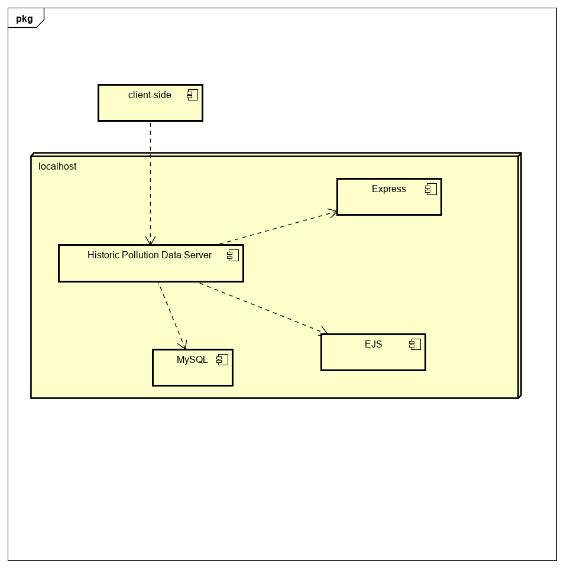

# Deployment

## Release Notes

### System Version:

The current version of the system is  v1.0-alpha.

### Dependencies:
```
  "dependencies": {
    "ejs": "3.1.6",
    "express": "4.17.1",
    "mysql": "^2.18.1"
  },
  "devDependencies": {
    "eslint": "^7.25.0",
    "mocha": "8.3.2",
    "testcafe": "^1.14.0"
  },
  ```
  <figcaption><em>Output 3:</em> The above output shows the dependencies installed.</figcaption>
 
### Software Tools:

* VSCode
* MySQL Workbench
* Node.js
* GitHub
* Astah
* Wireframes (Whimsical)
* Open Data Bristol

### URL of Deployed System:

http://localhost:8080/index.html

### Deployment Diagram:


<figcaption><em>Figure 8: </em>The above image represents a Deployment Diagram.</figcaption>

# User guide

## UC1: See all pollution records from March:

### Scenario:

A council official, which we have classified within the *Healthy Citizen actor*, has been requested to analyse how the national lockdown impacted the emission of particles such as Nitrogen Dioxide (NO2) around certain locations in Bristol during the month of March. To complete this task, the official will visit the *Historic Pollution Data* website which is kept updated by the *maintainer*. On this website the user will be able to select a table with the name of *See pollution records from March*, he will then narrow down his search by *selecting* his desired location e.g., Temple Way. This request will be rendered by the *Historic Pollution Data Server* which will send a query to the *Database* so that a result is provided to the original request made by the official. 

### Screenshots:


<figcaption><em>Figure 9: </em>The user clicks on <i>See pollution records from March.</i></figcaption>


<figcaption><em>Figure 10: </em>The user clicks on <i>Temple Way.</i> to narrow down the search</figcaption>

## UC2: Find locations with high pollution levels:

### Scenario:

A person who has asthma has been advised to check the pollution levels at different days, and times of the day around the locations she usually passes by when walking with her friends. She was advised to visit the *Historic Pollution Data* website, which is kept updated by the *maintainer*, on it she will be able to select a table with the name of *Find locations with high pollution levels* , once she clicks on this table she will be able to narrow down her search by *selecting* the location she usually walks by with her friends to make sure Nitrogen Dioxide (NO2) pollution levels in that location are not higher or equal to 100µg/m3. By following these steps, she will have peace of mind that her condition will not ruin a walk with her friends. 


### Screenshots:


<figcaption><em>Figure 11: </em>The user clicks on <i>Find locations with high pollution levels.</i></figcaption>


<figcaption><em>Figure 12: </em>The user clicks on <i>Temple Way.</i> to narrow down the search</figcaption>

## UC3: Find locations with low pollution levels:

### Scenario:

A runner is preparing for a marathon, so he knows he needs to be in optimal condition to perform against other participants, as such he needs to know what locations in Bristol have low pollution levels, and the variation of pollutions at different times of the day so that he can plan his training ahead. To achieve this goal he stopped by the *Historic Pollution Data* website which is kept updated by the *maintainer* , and allows him to select a table with the name of *Find locations with low pollution levels*, once he clicks on this table he will be able to narrow down his search by *selecting* the location that is closer to him to know if Nitrogen Dioxide (NO2) pollution levels in that location are lower or equal to 8µg/m3. By following these steps, he will be able to maximise his training, and be better prepared for the marathon. 

### Screenshots:


<figcaption><em>Figure 13: </em>The user clicks on <i>Find locations with low pollution levels.</i></figcaption>


<figcaption><em>Figure 14: </em>The user clicks on <i>Temple Way.</i> to narrow down the search</figcaption>
