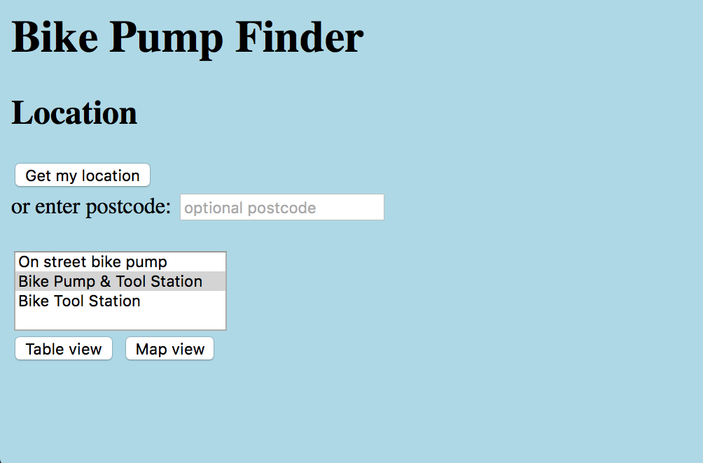

# Deployment

## Release Notes

### System Version:

The current version of the system is  v1.0-alpha.

### Dependencies:
```
  "dependencies": {
    "ejs": "3.1.6",
    "express": "4.17.1",
    "mysql": "^2.18.1"
  },
  "devDependencies": {
    "eslint": "^7.25.0",
    "mocha": "8.3.2",
    "testcafe": "^1.14.0"
  },
  ```
  <figcaption><em>Output 3:</em> The above output shows the dependencies installed.</figcaption>
 
### Software Tools:

* VSCode
* MySQL Workbench
* Node.js
* GitHub
* Astah
* Wireframes (Whimsical)
* Open Data Bristol

### URL of Deployed System:

http://localhost:8080/index.html

### Deployment Diagram:


<figcaption><em>Figure 8: </em>The above image represents a Deployment Diagram.</figcaption>

# User guide
TODO: Explain how each use-case works by providing step-by-step screenshots for each use-case. This should be based on a tested scenario.
## UC1: See all pollution records from March:

### Scenario:
A council official, which we have classified within the Healthy Citizen actor, has been requested to analyse how the national lockdown impacted the emission of particles such as Nitrogen Dioxide (NO2) around certain locations in Bristol during the month of March. To complete this task, the official will visit the Historic Pollution Data website which is kept updated by the maintainer. On this website the user will be able to select a table with the name of See pollution records from March, he will then narrow down his search by selecting his desired location e.g., Temple Way. This request will be rendered by the Historic Pollution Data Server which will send a query to the Database so that a result is provided to the original request made by the official.


<figcaption><em>Figure 9: </em>The user clicks on <i>See pollution records from March.</i></figcaption>


<figcaption><em>Figure 10: </em>The user clicks on <i>Temple Way.</i> to narrow down the search</figcaption>

## UC2: Find locations with high pollution levels:
### Scenario:

## UC3: Find locations with low pollution levels:
### Scenario:


TODO: Repeat as necessary
