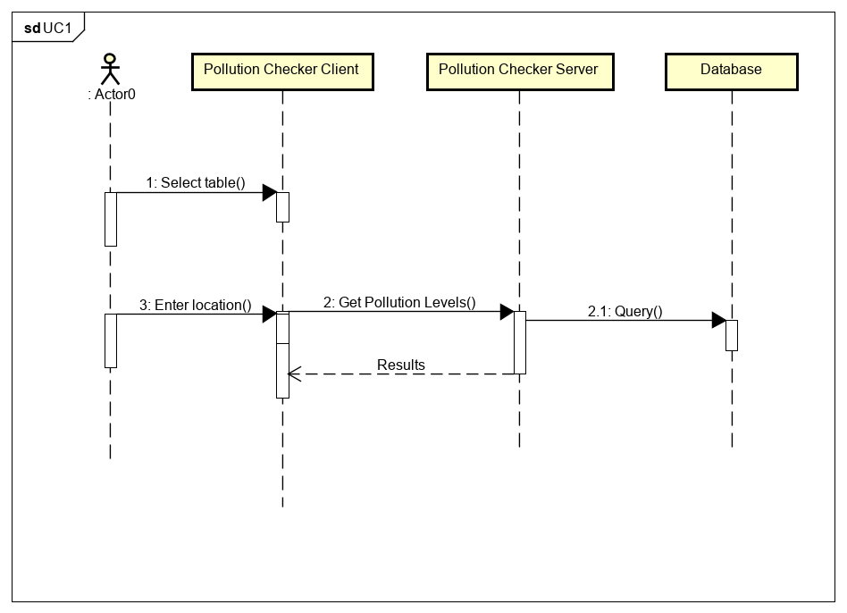

# Design

## Behavioural design

### Scenario UC1
TODO: Describe a concrete scenario for each use-case. 
Describe it in terms of interactions between the components introduces above, and the actors introduced in your requirements.

### Scenario UC2&3

### Sequence Diagram UC1

### Sequence Diagram UC2&3

## User Interface design
TODO: Specify and develop a user interface mockup using an HTML wireframe.

TODO: repeat as necessary