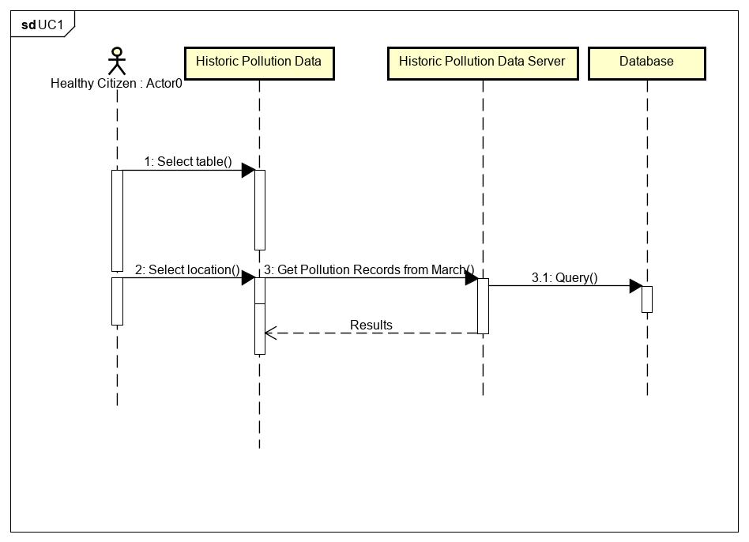

# Design

## Behavioural design

### Scenario UC1
A person who does weekly activities outdoors is interested to understand what the pollution levels have been in his area over the past days, or weeks, by doing so he hopes that by analysing this data he can see patternhs, or spykes of pollution against certain times and areas, thus allowing him to choose a time and area that will provide greater benefit to his outdoor activities.

### Scenario UC2&3
A granpa is taking his grandsons out for a walk, but he knows it is peak hour so he wants to compare the areas with higher concentration of pollution, against areas with lower levels of pollution, this will enable him to avoid certain areas with higher levels of pollution. 

### Sequence Diagram UC1

### Sequence Diagram UC2&3

## User Interface design
TODO: Specify and develop a user interface mockup using an HTML wireframe.

