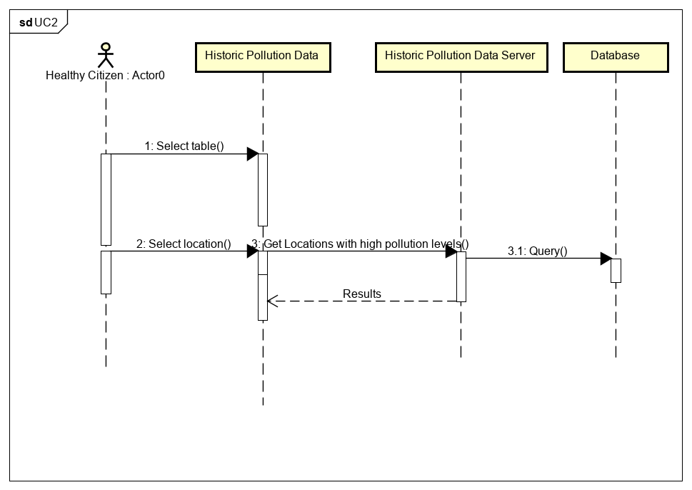

# Design

## Behavioural design

### Scenario UC1

A council official, which we have classified within the *Healthy Citizen actor*, has been requested to analyse how the national lockdown impacted the emission of particles such as Nitrogen Dioxide (NO2) around certain locations in Bristol during the month of March. To complete this task, the official will visit the *Historic Pollution Data* website which is kept updated by the maintainer. On this website the user will be able to select a table with the name of *See pollution records from March*, he will then narrow down his search by *selecting* his desired location e.g., Temple Way. This request will be rendered by the *Historic Pollution Data Server* which will send a query to the *Database* so that a result is provided to the original request made by the official. 

### Sequence Diagram UC1

### Scenario UC2
A granpa is taking his grandsons out for a walk, but he knows it is peak hour so he wants to compare the areas with higher concentration of pollution, against areas with lower levels of pollution, this will enable him to avoid certain areas with higher levels of pollution. 

### Sequence Diagram UC2

### Scenario UC3
A granpa is taking his grandsons out for a walk, but he knows it is peak hour so he wants to compare the areas with higher concentration of pollution, against areas with lower levels of pollution, this will enable him to avoid certain areas with higher levels of pollution. 

### Sequence Diagram UC3

## User Interface design
TODO: Specify and develop a user interface mockup using an HTML wireframe.

