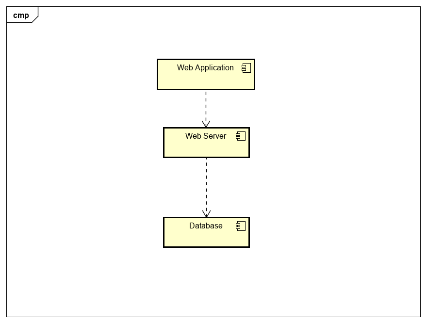

# Implementation

## Introduction
**System Version:** The current version of the system is  v1.0-alpha.

**Dataset:** The dataset used is called Air Quality Data Continuous. It was published on the Open Data Bristol website by the Sustainability Team.  Broadly speaking the dataset contains measurements of different types of pollutants across areas of Bristol during different times of day.

**Issues:** Since the dataset also contains historic measurements from as far as 1993, it became highly complex to download more than 1 million records. Downloading records from one year also proved complex, as such it was agreed with Steve to download records from a particular month (March) from a given year (2021) and then upload it to the schema ISD on MySQL. 

**Configuration data:** MySQL created a sys schema that works as configuration data.

## Project Structure

```
├── conf.json // JavaScript Object Notation - Used for configuration data
├── dbconnect // It enables a connection to MySQL
├── e2e // This enables maintainers to test the application flow by simulating a real user scenario
├── main.js // Provides our project with a logic. E.g. it contains queries to the server. 
├── node_modules // It contains every installed dependency for the project
├── package-lock.json
├── package.json // Used for managing the project's dependencies
├── static
├── test
└── views
```


```
C:\Users\hoyos\Documents\GitHub\Air-Quality-Data-Continuous\main.js
    1:17  error  'require' is not defined            no-undef
    2:15  error  'require' is not defined            no-undef
    3:14  error  'require' is not defined            no-undef
    4:1   error  'process' is not defined            no-undef
    4:22  error  'process' is not defined            no-undef
   25:55  error  'fields' is defined but never used  no-unused-vars
   34:81  error  'fields' is defined but never used  no-unused-vars
   54:82  error  'fields' is defined but never used  no-unused-vars
   66:55  error  'fields' is defined but never used  no-unused-vars
   75:81  error  'fields' is defined but never used  no-unused-vars
   88:55  error  'fields' is defined but never used  no-unused-vars
   97:81  error  'fields' is defined but never used  no-unused-vars
  111:46  error  'process' is not defined            no-undef
  126:4   error  Mixed spaces and tabs               no-mixed-spaces-and-tabs
  130:5   error  'process' is not defined            no-undef
  131:22  error  'process' is not defined            no-undef
  132:46  error  'process' is not defined            no-undef
  136:1   error  'exports' is not defined            no-undef
  137:1   error  'exports' is not defined            no-undef
  138:1   error  'exports' is not defined            no-undef

✖ 20 problems (20 errors, 0 warnings)

```
ESLint has detected, 0 warnings and 20 errors from three different categories:
* **no-undef** - Which translates to a variable not being declared.
* **no-unused-vars** - This errors come as a result of having variables in the code that are declared but not being used. These variables can take up space and can lead to confusion by other stakeholders. 
* **no-mixed-spaces-and-tabs** - This error is due to a line of code being indented with both tabs and spaces. By convention it is required either tabs or spaces for indentation. 


## Software Architecture

### 3-tier Architecture
The arhitecture style being used for the development of this project is the so called 3-tier Architecture because our project is composed of the next three tiers:
<ol> <li><b>Presentation Tier</b> - It provides the user interface, on our project it is our HTML website itself where users can interact with the different UC's.</li><li><b> Business Tier</b> - It deals with user inputs, it queries the database as to return a result from the query</li><li> <b>Data tier:</b> - It provides our HTML project with the necessary data, it runs on MySQL </li></ol> 
TODO: Describe the major components of your architecture. Are any particular arc
hitectural styles being used?


<figcaption><em>Figure 7: </em>The above image represents the Component Diagram for our project.</figcaption>
