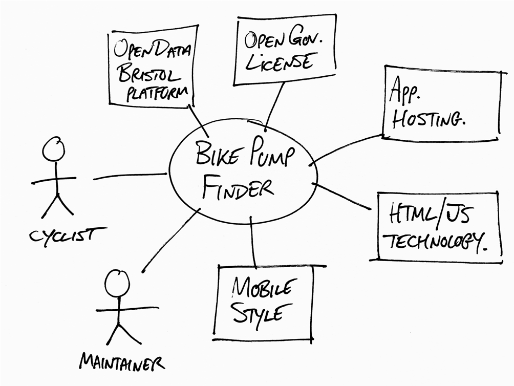

# Project Proposal

## Business Case

### Problem statement
Pollution is known to have a harmful effect on people who are exposed to it on a regular basis. Bristol due to the amount of traffic during peak hours concentrates high levels of poluttion, as such people that want to do activities outsied might find themselves breathing air of poor quality , which undermines their initial goal of living a healthy live by doing any type of exercise. If we can tell people who live local to Bristol what areas concentrate the highest amount of Carbon Dioxide, then it would allow them to plan their journey ahead, and minimise their exposure to toxic air. 

### Business benefits
TODO: List high-level benefits that this product will provide.

### Options Considered
TODO: What are some other customer options or leading products that address the same needs?

### Expected Risks
TODO: What are the main risks of this project?

## Project Scope
TODO: Scope of the System of Interest. Include a bullet list of things from your context diagram that are in scope.

