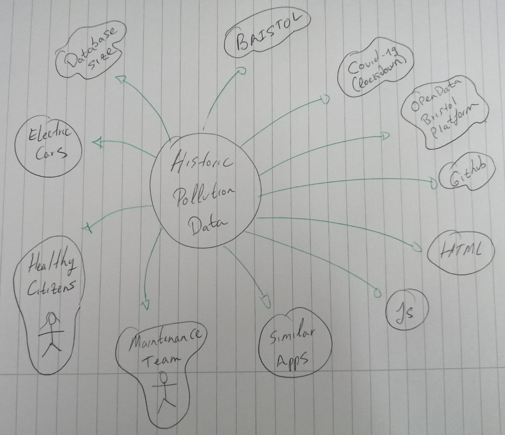

# Project Proposal

## Business Case

### Problem statement
Pollution is known to have a harmful effect on people who are exposed to it on a regular basis. In a study published in 2019 by Public Health England, it was estimated that long-term exposure to air pollution is killing between 28,000 and 36,000 in the UK; it is the biggest environmental threat to health in the UK.

In Bristol, due to the amount of traffic during peak hours, high levels of pollution is concentrated in certain locations of the city. As consequence, people wanting to do activities outside might find themselves breathing air of poor quality, which undermines their initial goal of living a healthy life by exercising outdoors. If people who live local to Bristol can tell which locations concentrate the highest number of harmful particles, and their concentration levels at different times of the day, then it would allow them to draw their own conclusions, thus plan their outdoors exercise accordingly, and minimising their exposure to this toxic air. 

### Business benefits
* Promote exercising outdoors.
* Help identify corelation of higher number of cars with higher air pollution if otherwise. 
* Help identify areas with higher pollution levels so that the Council takes action.
* People can minimise breathing air of poor quality by checking historic statistics on pollution and draw conclusions from data.
* Local shops located in areas with less pollution might see an increase in their sales, as a result of more people doing outdoors exercise in those areas.
* Life expectancy might increase as a result of people choosing the quality of the air they breath. 
* Diseases associated to pollution might decrease overtime, thus decreasing deaths attributed to air pollution.

### Options Considered
* Department for Environment Food & Rural Affairs - UK Air Information Resource.
* BBC Pollution Postcode Checker.
* Air Quality England.

### Expected Risks
* Users are already used to the available options; hence low engagement might occur. 
* Due to the pandemic, pollution levels might have decreased in general, hence users might anticipate air pollutions remains low throughout the city.  
* People not understanding the values presented on the project.

## Project Scope
Below is a detailed list of every entity that applies to our project scope:

* **People exercising outdoors** - This audience is to be targeted as they prioritize areas with less pollution to do exercise and will be more likely to use our app than other audiences. 
* **Bristol** - As the dataset is relevant to Bristol, we are focusing our app in providing value to those living in Bristol only.
* Our app should work in mobile devices with **Android**, or **IOS** as well as on **websites**. 
* **HTML** will be used for the design process as indicated in the assignment specifications. 
* **Github** will provide us with the means to work collaboratively as well as a mean of having our documentation checked. 
* **Similar Apps** will be researched to make sure we provide added value, and not the same features already offered by the common pollution checkers.

<figcaption><em>Figure 1: </em>The above image represents a Context Diagram, it represents external components that can impact the project, or can be affected by it.</figcaption>
