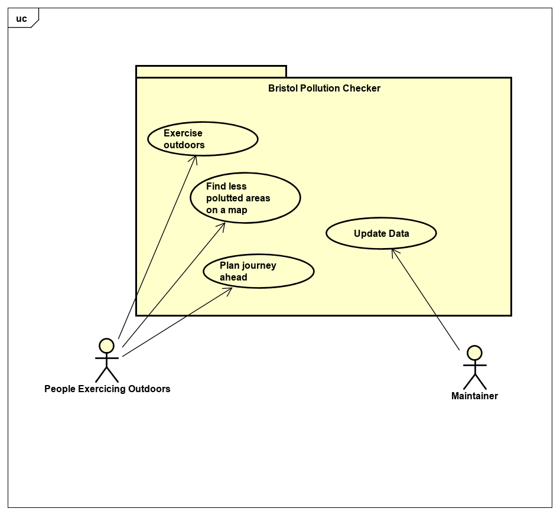

# Requirements

## User Needs

### Actors
- People exercising outdoors, such as runners, cyclist, walkers etc. 
- People living within Bristol, interested in air quality.
- Environment and health concious people.

### User stories

1. As a daily runner I want to exercise in an area with the less possible amount of CO2, so that I can maximize quality air consumption to increase my performance.
2. As middle age person exercising outdoors I want to find the less polluted area on Bristol so that I can continue to live a healthy life, and maintain motivated to do so. 
3. As a person with asthma I want to find a place in Bristol where there is little pollution so that I can enjoy a walk with my friends.

### Use Cases

| UC1        | Exercising Outdoors | 
| -------------------------------------- | ------------------- |
| **Description** | People that are exercising outdoors should have access to air quality data. That would allow them choose areas that are less polluted. Aiming to find best quality air locally for their sport activity.|
| **Actors** | People, that are active outdoors e.g. cyclist, runners.|
| **Assumptions** | Assume that user would have the app downloaded. Assume, that the user is located within Bristol boundry.|
| **Steps** | People exercising outdoors would download the app. Next they would type their postcode to enable system to show their area's air qulaity. System would get information from data base to show the pollution level at their present localtion and show  cleaner areas nearby. System would also be connected to maps to show the results more clearly.|

| UC2        | Find Less Polluted Areas On a Map | 
| -------------------------------------- | ------------------- |
| **Description** | As a person exercising outdoors I want to be able to find the less poluted areas on a map |
| **Actors** | Anyone exercising outdoors |
| **Assumptions** | Geo-location is supported on the person's device |
| **Steps** | <ul><li>Opt to view less polluted areas in Bristol</li><li>Request permission to access user location</li><li>Give permission for geo-location</li><li>Get less polluted areas from database</li><li>View list of less pulluted areas</li></ul> |

| UC3        | Plan Journey Ahead | 
| -------------------------------------- | ------------------- |
| **Description** | Those who exercise outdoors should know which areas are less polluted as it allows them to plan future journeys whilst being health conscious |
| **Actors** | People who exercise outdoors |
| **Assumptions** | Assuming the user has downloaded the app and entered their postcode, the locations with less polution are the locations the future journey will be planned for and set to |
| **Steps** | Users download the app then enter their postcode so the system can collect data then show areas of low pollution. The user can then decide which route is best to take for their future outdoor exercie. 

### Use-Case diagram

## Software Requirements Specification

### Functional requirements
  
|  ***Functional requirements*** |   ***Definition*** |    ***Use-Case*** | 
| -------------------------------------- | ------------------- | ------------------- |
| **FR1** | The system could get user geo-location. | UC1 |
| **FR2** | The system shall get the less polluted areas from database. | UC2 |
| **FR3** | The system should allow users to plan ahead a less polluted route.  | UC2 |
| **FR4** | The system won't act as a GPS to guide people to the less pulluted areas. | UC3 |

### Non-Functional Requirements

|  ***Non-Functional requirements*** |   ***Definition*** |    ***Use-Case*** | 
| -------------------------------------- | ------------------- | ------------------- |
| **NFR1** | The app should work on iOS (Portability) | UC1 |
| **NFR2** | Less polluted areas should to be no further than 1 mile from person looking to exercise outdoors (usability) | UC1, UC2, UC3 |
| **NFR4** | It should display up to 10 nearest less polluted areas on one page (usability) | UC1, UC2, UC3 |
| **NFR5** | It should make suggestions wheather the area is a good place to exercise or not (usability) | UC1, UC2, UC3 |
| **NFR6** | It must show current location pollution level (reliability) | UC1, UC2, UC3

