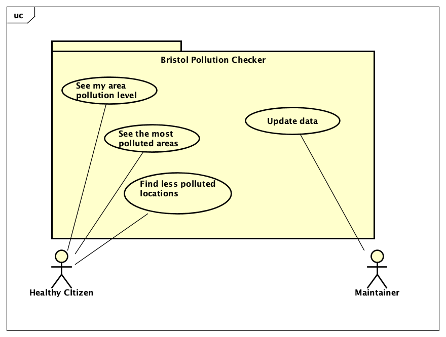

# Requirements

## User Needs

### Actors

**Healthy Citizen:**
1. People exercising outdoors, such as runners, cyclists, or walkers. 
2. People with health conditions that rely on quality air to live a healthy life, such as those suffering from asthma.
3. Council officials who monitor air pollution levels to prevent harmful spikes.

**Maintainer** who takes care of the app, fixes problems and develops new features. 

### User stories

1. As a Bristol health official I want to see the pollution records from March, so that I can study the effects of the national lockdown on air pollution. 
2. As a runner I want to find the less polluted locations in Bristol, so that I can breathe quality air while doing exercise outdoors. 
3. As a person with asthma I want to find the most polluted locations in Bristol, so that I can prevent those areas, and my life is not in danger while walking outdoors.

### Use Cases

| UC1        | See my area pollution level | 
| -------------------------------------- | ------------------- |
| **Description** | As a person interested in pollution data, I want to view pollution levels in my area. I would like to know air conditions at my daily location and be able to choose different places to go out for an activity if needed.|
| **Actors** | Healthy Citizens.|
| **Assumptions** | Assume that user would have the app downloaded. Assume, that the user is located within Bristol boundary.|
| **Steps** | <ol> <li> Opt to view my area pollution levels.</li><li>Choose your area from the dropdown available.</li><li>Get the chosen area information from database.</li><li>Show the results to the user.</li><li>Suggest less polluted areas nearby.</li> </ol>|
| **Variations** |  |
| **Non-functional** |  |
| **Issues** | Some specific location data may not be available. |

| UC2        | Find locations with high pollution levels | 
| -------------------------------------- | ------------------- |
| **Description** | As a person exercising outdoors I would like to know which areas are most polluted, as it allows me to plan future journeys whilst being health conscious. |
| **Actors** | Healthy Citizens. |
| **Assumptions** | Assuming the user has downloaded the app. |
| **Steps** | <ol> <li>User download the app.</li><li>The user chooses the location to view. </li><li>The system collect data from database.</li><li>Displaying results for chosen location.</li> </ol>|
| **Variations** |  |
| **Non-functional** |  |
| **Issues** |  |

| UC3       | Find locations with low pollution levels| 
| -------------------------------------- | ------------------- |
| **Description** | As a person exercising outdoor and interested in air quality I want to be able to find the less polluted area. |
| **Actors** | Healthy Citizens. |
| **Assumptions** | Geo-location is supported on the person's device. |
| **Steps** | <ol>  <li>Opt to view less polluted areas in Bristol</li><li>Request permission to access user location</li> <li>Give permission for geo-location</li> <li>Get less polluted areas from database</li> <li>View list of less polluted areas</li> </ol>  |
| **Variations** |  |
| **Non-functional** |  |
| **Issues** |  |
### Use-Case diagram

## Software Requirements Specification

### Functional requirements
  
|  ***Functional requirements*** |   ***Definition*** |    ***Use-Case*** | 
| -------------------------------------- | ------------------- | ------------------- |
| **FR1** | The system could get user geo-location. | UC1 |
| **FR2** | The system shall get the less polluted areas from database. | UC2 |
| **FR3** | The system should allow users to plan ahead a less polluted route.  | UC2 |
| **FR4** | The system won't act as a GPS to guide people to the less polluted areas. | UC3 |
| **tbd** | tbd | tbd |

### Non-Functional Requirements

|  ***Non-Functional requirements*** |   ***Definition*** |    ***Use-Case*** | 
| -------------------------------------- | ------------------- | ------------------- |
| **NFR1** | The app should work on iOS (Portability) | UC1 |
| **NFR2** | Less polluted areas should not be further than 1 mile from person looking to exercise outdoors (usability) | UC2 |
| **NFR4** | It should display up to 5 nearest less polluted areas on one page (usability) | UC3 |
| **NFR5** | It could make suggestions wheather the area is a good place to exercise or not (usability) | UC1, UC2, UC3 |
| **NFR6** | It must show current pollution levels in the location provided (reliability) | UC1, UC2, UC3 |

