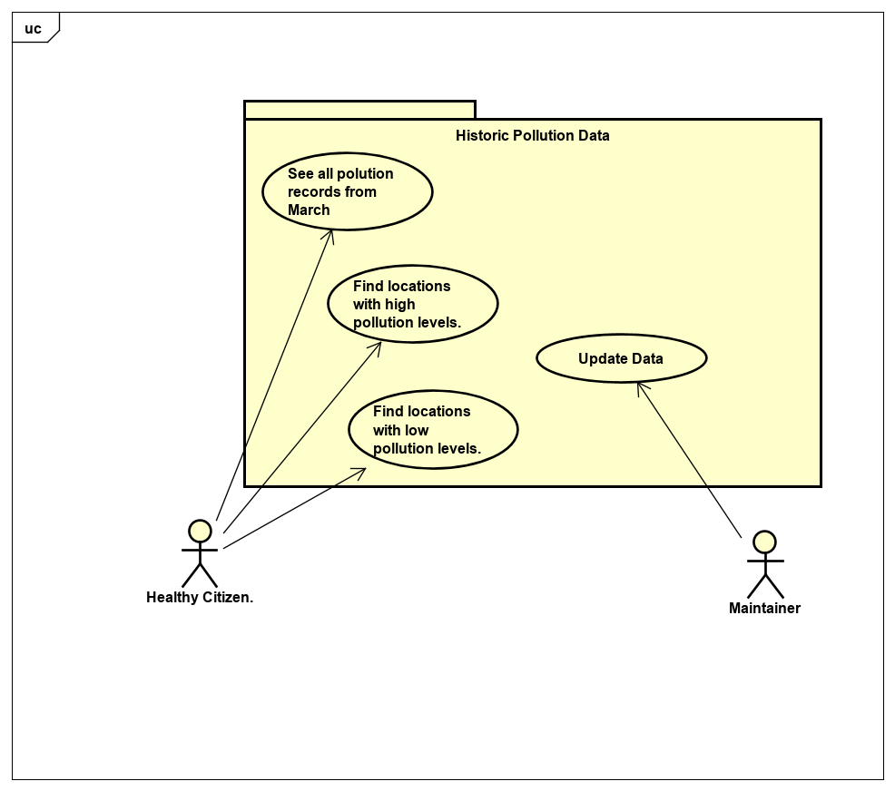

# Requirements

## User Needs

### Actors

**Healthy Citizen:**
1. People exercising outdoors, such as runners, cyclists, or walkers. 
2. People with health conditions that rely on quality air to live a healthy life, such as those suffering from asthma.
3. Council officials who monitor air pollution levels to prevent harmful spikes.

**Maintainer** who takes care of the app, fixes problems and develops new features. 

### User stories

1. As a Bristol health official I want to see the pollution records from March, so that I can study the effects of the national lockdown on air pollution. 
2. As a person with asthma I want to find the most polluted locations in Bristol, so that I can prevent those areas, and my life is not in danger while walking outdoors.
3. As a runner I want to find the less polluted locations in Bristol, so that I can breathe quality air while doing exercise outdoors.

### Use Cases

| UC1        | See all pollution records from March | 
| -------------------------------------- | ------------------- |
| **Description** | As my job being advising the Bristol Council on air pollution I want to understand what effect had less traffic as conscequence of the national lockdown on air pollution. To do this I want to be able to see all the records on air pollution from March.|
| **Actors** | Healthy Citizens.|
| **Assumptions** | <ul> Assume user understands how pollution particles are measured.</ul><ul> Assume that the user is located within Bristol. </ul>|
| **Steps** | <ol> <li> *Open Historic Pollution Data*.</li><li>Click on *See all pollution records from March* on the nav section .</li><li>Show the results to the user.</li><li>To narrow down the search send location string by clicking location buttons on the header.</li><li>Show the results to the user.</li></ol>|
| **Variations** |  |
| **Non-functional** |  |
| **Issues** | Measurements from specific locations may not be available. |

| UC2        | Find locations with high pollution levels | 
| -------------------------------------- | ------------------- |
| **Description** | As a long asthma sufferer I would like to know which areas are most polluted, as it allows me to plan future journeys whilst preventing my condition to deteriorate. To do this I want to see a list that shows me Nitrogen Dioxide (NO2) pollution records that are higher or equal to 100µg/m3 , and matched against their location and time.  |
| **Actors** | Healthy Citizens. |
| **Assumptions** | <ul> Assume user understands how pollution particles are measured.</ul><ul> Assume that the user is located within Bristol. </ul> |
| **Steps** | <ol><li> *Open Historic Pollution Data*.</li><li>Click on *Find locations with high pollution levels* on the nav section .</li><li>Show the results to the user.</li><li>To narrow down the search send location string by clicking location buttons on the header.</li><li>Show the results to the user.</li></ol>|
| **Variations** |  |
| **Non-functional** |  |
| **Issues** |  |

| UC3       | Find locations with low pollution levels| 
| -------------------------------------- | ------------------- |
| **Description** | As a person exercising outdoors, I want to be able to find the less polluted locations, and times to improve my performance. To do this I want to see a list that shows me Nitrogen Dioxide (NO2) pollution records that are lower or equal to 8.0µg/m3 , and matched against their location and time.  |
| **Actors** | Healthy Citizens. |
| **Assumptions** | <ul> Assume user understands how pollution particles are measured.</ul><ul> Assume that the user is located within Bristol. </ul> |
| **Steps** | <ol> <li> *Open Historic Pollution Data*.</li><li>Click on *Find locations with low pollution levels* on the nav section</li><li>Show the results to the user.</li><li>To narrow down the search send location string by clicking location buttons on the header.</li><li>Show the results to the user.</li></ol>  |
| **Variations** |  |
| **Non-functional** |  |
| **Issues** |  |
### Use-Case diagram

<figcaption><i>Figure 2</i>The above image represents a UseCase Diagram where an association between each use case and actor is created within a system. This process is known as Use Case Modeling</figcaption>

## Software Requirements Specification

### Functional requirements
  
|  ***Functional requirements*** |   ***Definition*** |    ***Use-Case*** | 
| -------------------------------------- | ------------------- | ------------------- |
| **FR1** | The system must get all pollution records from the database. | UC1 |
| **FR2** | The system should get all pollution records from the locations user selects. | UC1 |
| **FR3** | The system could have a map that pintpoints total records collected over the years. | UC1 |
| **FR4** | The system could have an audio that helps the user navigate our website. | UC1 |
| **FR5** | The system must get Nitrogen Dioxide (NO2) pollution records from the database that are higher or equal to 100µg/m3   | UC2 |
| **FR6** | The system should get the highest pollution records from the locations the user selects. | UC2 |
| **FR7** | The system won't have a date/time picker to narrow down the search of the most polluted locations. | UC2 |
| **FR8** | The system must get Nitrogen Dioxide (NO2) pollution records from the database that are lower or equal to 8µg/m3   | UC3 |
| **FR9** | The system should get the lowest pollution records from the locations the user selects. | UC3 |
| **FR10** | The system won't have a GPS function that guides people to the less polluted areas. | UC3 |

### Non-Functional Requirements

|  ***Non-Functional requirements*** |   ***Definition*** |    ***Use-Case*** | 
| -------------------------------------- | ------------------- | ------------------- |
| **NFR1** | Accessibility - The font size shall be big enough for users to easily read through rows of data. | UC1 |
| **NFR2** | Data integrity - The data shall be maintained and shall be accurate and consistent. | UC1 |
| **NFR3** | Documentation - The project and the use-case-specific data shall be accompanied with its corresponding documentation that explain the attributes of the system | UC1 | **NFR4** | Data integrity - The data shall be maintained, and shall be accurate and consistent. | UC1 |
| **NFR5** | Extensibility - The use-case-specific data and environment shall be extended with new functionalities in the future to improve the user's experience. | UC2 |
| **NFR6** | Operability - The use-case-specific data, and the whole system shall be reliable, and date kept in a safe condition. | UC2 |
| **NFR7** | Platform compatibility - The use-case-specific data, and the whole system shall be compatible with different web browsers such as Safari, Chrome, Firefox, or Edge. | UC1 |
| **NFR8** | Reusability - The use-case-specific data, and the whole system shall be reusable as to replicate similar functionalities in upcoming versions. | UC3 |
| **NFR9** | Robustness - In the event of an expected error in the handling of the use-case-specific data, or the whole system, it shall output to the user the most likely cause of error so that it can be dealt effectively | UC3 |
